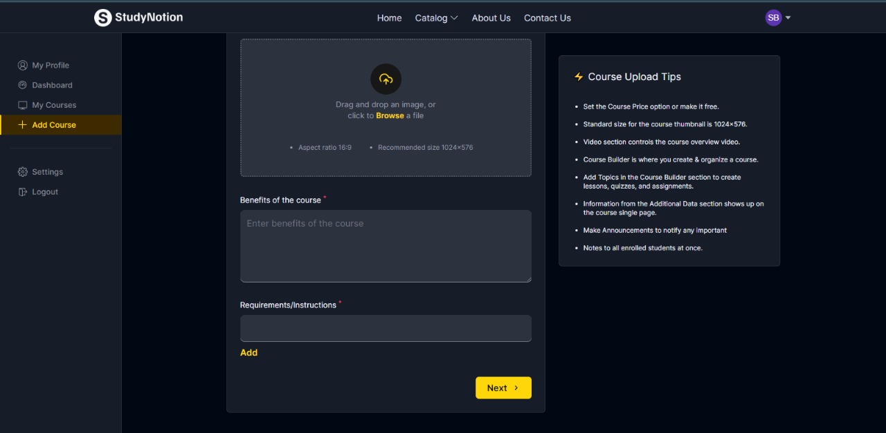

# StudyNotion Edtech Project

## Introduction

StudyNotion is a groundbreaking educational technology platform poised to redefine the way students, teachers, and lifelong learners engage with knowledge.

## Introduction Video

StudyNotion Website Video [here](./public/studynotion.mp4).

## Problem Statement

- **Challenges in Education**: Lack of personalization, adaptability, and limited access to quality resources.
- **Conventional Issues**: One-size-fits-all approach, information overload.
- **StudyNotion's Goal**: Revolutionize education with a dynamic, interactive, and adaptable platform offering diverse courses.

## Scope

- **Comprehensive Platform**: Diverse course catalog for varied learning needs.
- **User-Centric Design**: Accessible, intuitive interface with continuous feedback integration.
- **Global Accessibility**: Responsive design for all devices.
- **Personalization and Interactivity**: Tailored learning experiences and support for educators.
- **Lifelong Learning**: Ongoing education and professional development.
- **Privacy and Flexibility**: Strong data privacy and self-paced learning.
- **Community Engagement**: Agile response to user feedback for an evolving educational community.

## Relational Database Design

The relational database design for StudyNotion includes an ER diagram which outlines the structure and relationships of data within the platform.

## Graphical User Interface

### Frontend

Frontend in StudyNotion is the user-centric interface that students, educators, and lifelong learners interact with directly in their web browsers. It encompasses UI/UX design (Figure 4.1), responsive web elements, and the use of HTML, CSS, and JavaScript to create an engaging and user-friendly experience. The frontend communicates with the backend to provide dynamic content and ensure seamless interactivity.

### Login Page

The Login Page in StudyNotion serves as the entry point for users to access their accounts and the platform's rich educational resources. It features fields for entering usernames or email addresses and password (Figure 4.2). In case users forget their login details, a "Forgot Password" link is provided for easy recovery. Upon successful login, the backend initiates the authentication process, granting access to the user's personalized learning journey within StudyNotion.

### Adding Courses: Insert Function

In StudyNotion, the process of adding courses is a fundamental aspect of providing a personalized and dynamic learning experience for our users. The "Insert Course" function streamlines this process to ensure that students, educators, and lifelong learners can seamlessly integrate new courses into their learning journey.

1. User Authentication: Users must log in to their StudyNotion accounts to access this feature.
2. Navigation to the "Insert Course" Feature: Accessible from the user dashboard or a dedicated "Add Course" section.
   
3. Course Details Entry: Users enter the course title, description, and category.
4. Upload Course Materials: Users can upload syllabus and learning resources.
   
5. Course Visibility and Privacy: Users choose public/private settings and access control.
6. Save and Publish: Users save and publish the course for discovery and enrollment.
7. Course Management: Users can manage and update courses, view all courses from the "My Courses" section.
   

### Update Profile Information: Update Function

The "Update Profile Information" function within StudyNotion empowers users to maintain the currency of their profiles, offering real-time adjustments to their personal information, bio, social links, and privacy settings. It ensures that users can present the most up-to-date and relevant information, thus enhancing their personalized experience on the platform.

### Delete User Account: Delete Function

The "Delete Account" feature provides users with a secure way to manage their presence on StudyNotion. After verifying their identity, users can initiate account deletion. This ensures that users have the flexibility and control to tailor their StudyNotion experience according to their needs and preferences.

### Courses Available

StudyNotion boasts a diverse and continually expanding array of courses to cater to a broad spectrum of learning interests and objectives. Whether you're a student aiming to excel academically, an educator seeking to enhance your teaching skills, or a lifelong learner with a passion for acquiring new knowledge, StudyNotion offers a comprehensive range of courses spanning subjects like academics, professional development, technology, the arts, language learning, health and wellness, personal growth, and much more.

<!-- ## Test Cases

1. **User Registration and Authentication:**

   - Verify successful registration with valid information.
   - Confirm email verification and account activation.
   - Ensure users cannot log in without email confirmation.

2. **Course Management:**

   - Test course creation with accurate details.
   - Verify enrolled users' access to course content.
   - Confirm educators' ability to manage course materials and student enrollment.

3. **Profile Management:**

   - Ensure users can edit their profile information.
   - Confirm users can only view their own profiles.

4. **Course Progress and Assessment:**

   - Verify users can track course progress.
   - Check accurate grading and recording of assessments.

5. **Search and Discovery:**
   - Test search functionality for finding courses.
   - Verify course recommendations based on user preferences. -->
